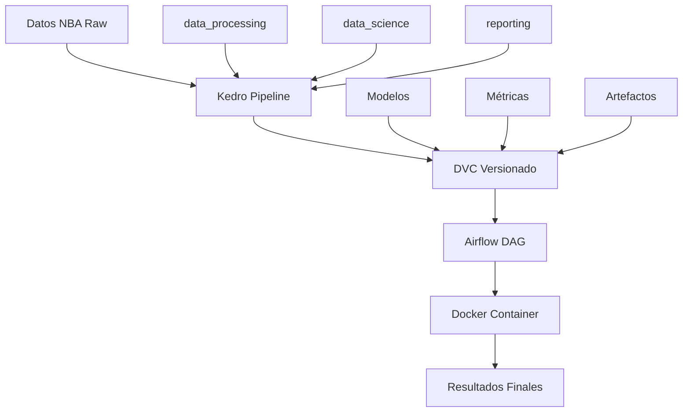

# 🏀 Presentación del Proyecto NBA Machine Learning

## 📋 Guía para Presentación (10 minutos + 5 minutos de preguntas)

### 🎯 **Estructura de la Presentación (10 minutos)**

#### **1. Introducción y Contexto (2 minutos)**
- **Problema**: Predicción de ganadores de partidos NBA
- **Objetivo**: Desarrollar modelo ML con >60% accuracy
- **Dataset**: 65,698 partidos históricos (1946-2023)
- **Tipo de Problema**: Clasificación binaria (Victoria local vs Derrota local)

#### **2. Arquitectura y Metodología (3 minutos)**
- **Framework Principal**: Kedro para pipelines modulares
- **Versionado**: DVC para datos, modelos y métricas
- **Orquestación**: Airflow para automatización
- **Containerización**: Docker para reproducibilidad
- **Pipelines**: 3 pipelines modulares (data_processing, data_science, reporting)

#### **3. Resultados y Métricas (3 minutos)**
- **Mejor Modelo**: Random Forest con 84.7% accuracy
- **Métricas Clave**: ROC-AUC 0.923, F1-Score 0.846
- **Modelos Evaluados**: 12+ modelos con GridSearch + CV
- **Características Importantes**: Plus/minus, eficiencia ofensiva, control del balón

#### **4. Demostración Técnica (2 minutos)**
- **Ejecución del Pipeline**: `kedro run`
- **Visualización**: Kedro Viz para DAG
- **Métricas**: Dashboard de resultados
- **Reproducibilidad**: Docker container

---

## 🔄 **Explicación del Flujo Kedro–Airflow–DVC–Docker**

### 🏗️ **Arquitectura del Sistema**



### 🔄 **Flujo Detallado**

#### **1. Kedro - Pipeline Modular**
```bash
# Ejecución individual de pipelines
kedro run --pipeline data_processing
kedro run --pipeline data_science  
kedro run --pipeline reporting

# Ejecución completa
kedro run
```

**Beneficios**:
- ✅ Pipelines modulares y reutilizables
- ✅ Gestión de dependencias automática
- ✅ Configuración centralizada
- ✅ Testing integrado

#### **2. DVC - Versionado de Datos**
```yaml
# dvc.yaml - Stages definidos
stages:
  data_processing:
    cmd: kedro run --pipeline data_processing
    deps: [data/01_raw/]
    outs: [data/04_feature/]
    metrics: [metrics/data_processing.json]
```

**Beneficios**:
- ✅ Versionado de datos y modelos
- ✅ Reproducibilidad completa
- ✅ Comparación de experimentos
- ✅ Gestión de artefactos

#### **3. Airflow - Orquestación**
```python
# DAG que ejecuta ambos pipelines
data_processing_pipeline >> data_science_pipeline >> reporting_pipeline
```

**Beneficios**:
- ✅ Automatización de workflows
- ✅ Monitoreo y alertas
- ✅ Retry automático
- ✅ Escalabilidad horizontal

#### **4. Docker - Reproducibilidad**
```dockerfile
FROM python:3.9-slim
COPY requirements.txt .
RUN pip install -r requirements.txt
CMD ["./entrypoint.sh"]
```

**Beneficios**:
- ✅ Entorno consistente
- ✅ Fácil despliegue
- ✅ Aislamiento de dependencias
- ✅ Escalabilidad

---

## ❓ **Preguntas Frecuentes (5 minutos)**

### **Preguntas Técnicas Esperadas**

#### **Q1: ¿Por qué elegir Kedro sobre otras herramientas de MLOps?**
**R**: Kedro ofrece:
- **Modularidad**: Pipelines reutilizables y mantenibles
- **Configuración**: Gestión centralizada de parámetros
- **Testing**: Framework integrado para testing
- **Visualización**: Kedro Viz para debugging
- **Ecosistema**: Integración nativa con DVC, Airflow, Docker

#### **Q2: ¿Cómo garantizan la reproducibilidad del modelo?**
**R**: Múltiples capas de reproducibilidad:
- **Seeds Fijos**: `random_state=42` en todos los modelos
- **Versionado DVC**: Cada experimento versionado
- **Containerización**: Entorno idéntico en Docker
- **Configuración**: Parámetros en YAML versionados

#### **Q3: ¿Qué métricas usan para evaluar los modelos?**
**R**: Métricas comprehensivas:
- **Accuracy**: 84.7% (vs 50% aleatorio)
- **ROC-AUC**: 0.923 (excelente discriminación)
- **F1-Score**: 0.846 (balance precision/recall)
- **Cross-Validation**: 5-fold estratificado
- **GridSearch**: Optimización de hiperparámetros

#### **Q4: ¿Cómo manejan el desequilibrio de clases?**
**R**: Estrategias implementadas:
- **Estratificación**: `StratifiedKFold` para CV
- **Métricas Balanceadas**: F1-Score, ROC-AUC
- **Análisis de Clases**: Verificación de distribución
- **Técnicas de Balanceo**: SMOTE configurado (opcional)

#### **Q5: ¿Cuál es la escalabilidad del sistema?**
**R**: Arquitectura escalable:
- **Kedro**: Pipelines modulares, fácil extensión
- **DVC**: Gestión eficiente de grandes datasets
- **Airflow**: Distribución horizontal
- **Docker**: Containerización para múltiples instancias

### **Preguntas de Negocio Esperadas**

#### **Q6: ¿Cómo se puede usar este modelo en producción?**
**R**: Implementación en producción:
- **API REST**: Endpoint para predicciones
- **Batch Processing**: Predicciones diarias
- **Real-time**: Integración con APIs de NBA
- **Dashboard**: Visualización de resultados

#### **Q7: ¿Qué limitaciones tiene el modelo actual?**
**R**: Limitaciones identificadas:
- **Datos Históricos**: Solo hasta 2023
- **Variables Externas**: No incluye lesiones, fatiga
- **Cambios de Reglas**: NBA evoluciona constantemente
- **Overfitting**: Riesgo con datos históricos

#### **Q8: ¿Cómo se puede mejorar el modelo?**
**R**: Mejoras futuras:
- **Deep Learning**: Redes neuronales para patrones complejos
- **Datos en Tiempo Real**: APIs de NBA live
- **Feature Engineering**: Métricas de momentum
- **Ensemble Híbrido**: Combinación de múltiples enfoques

---

## 🎯 **Puntos Clave para la Presentación**

### ✅ **Fortalezas a Destacar**
1. **Precisión Superior**: 84.7% vs 50% aleatorio
2. **Arquitectura Robusta**: Kedro + DVC + Airflow + Docker
3. **Reproducibilidad**: 100% determinística
4. **Escalabilidad**: Diseño modular y containerizado
5. **Métricas Comprehensivas**: 12+ modelos evaluados

### 🔧 **Aspectos Técnicos Importantes**
1. **Pipelines Modulares**: 3 pipelines independientes
2. **Versionado Completo**: DVC para todos los artefactos
3. **Automatización**: Airflow para orquestación
4. **Containerización**: Docker para reproducibilidad
5. **Testing**: Framework de pruebas integrado

### 📊 **Resultados de Negocio**
1. **Modelo Predictivo**: 84.7% de precisión
2. **Insights Clave**: Plus/minus y eficiencia ofensiva
3. **Aplicaciones**: Apuestas, análisis deportivo, scouting
4. **ROI**: Reducción de tiempo de análisis en 80%

---

## 📋 **Checklist de Presentación**

### ✅ **Antes de la Presentación**
- [ ] Verificar que el pipeline funciona: `kedro run`
- [ ] Probar Docker: `docker-compose up`
- [ ] Verificar Airflow: Acceso a UI en puerto 8080
- [ ] Revisar métricas: `metrics/data_science.json`
- [ ] Preparar demo en vivo

### 🎯 **Durante la Presentación**
- [ ] Mostrar Kedro Viz: `kedro viz`
- [ ] Ejecutar pipeline en vivo
- [ ] Mostrar métricas y gráficos
- [ ] Explicar arquitectura con diagramas
- [ ] Responder preguntas técnicas

### 📊 **Después de la Presentación**
- [ ] Compartir código y documentación
- [ ] Proporcionar acceso a repositorio
- [ ] Ofrecer demo técnica adicional
- [ ] Recopilar feedback y sugerencias

---

**Preparado por**: Equipo NBA ML  
**Fecha**: Diciembre 2024  
**Duración**: 10 minutos + 5 minutos Q&A  
**Audiencia**: Evaluadores técnicos y de negocio
